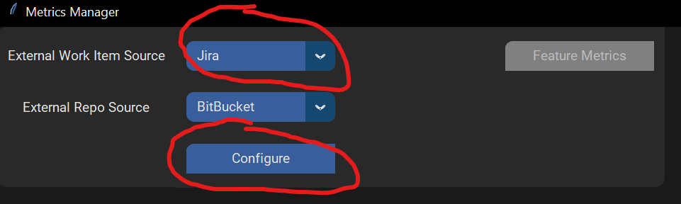
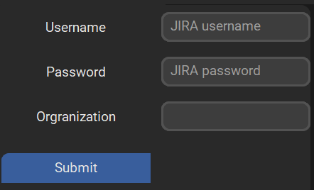
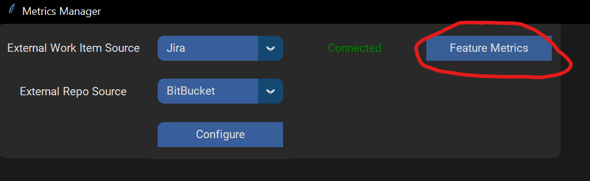
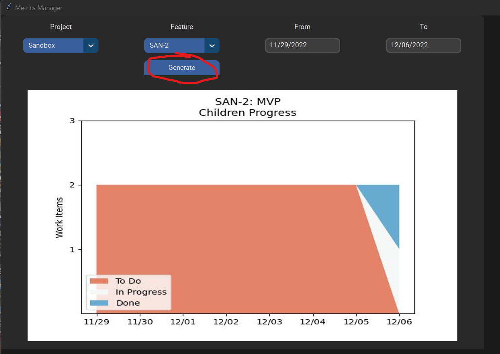

# Work Tracking Metrics
## Scope:
This tool is used quickly view heads up work tracking data (such as feature tracking, employee progress, etc) and abstract out the data source (ADO, Jira, etc).

## Installation:
1. Ensure python >= 3.9 is installed: [Pyhton installer](https://www.python.org/downloads/)
2. Run 'py -m build'
    * List of packages to Pip install. This should be completed by running 'py -m build', but just in case they need to be manually added:
        + [pillow](https://pypi.org/project/Pillow/)
        + [customtkinter](https://pypi.org/project/customtkinter/)
        + [seaborn](https://pypi.org/project/seaborn/)
        + [matplotlib](https://pypi.org/project/matplotlib/)

## Execution:
Spin up the customtkinter UI:
1. py desktopApplication.py
2. Configure your instance to the corresponding workitem and repo sources:

**TIP:** you can cache configurations by storing them as environment variables. Further elaborated on in the tips section below

Depending on what has been configured, functionality buttons will be enabled:

Feature Screen (example):
The Feature list will gather based off project, and the graph will show the corresponding children history based off from and to dates given:

## Tips:
OS Environment variables to cache:
+ ado_org: Organization string for ADO. Can be found in ADO base URL
+ ado_project: Project string for ADO. Can be found in ADO base URL
+ ado_username: Email address for user's ADO account. Not required
+ ado_PAT: Personal Access Token for ADO
+ jira_org: Organization string for Jira. Can be found in ADO base URL
+ jira_username: Email address for user's Jira account.
+ jira_PAT: Personal Access Token for Jira